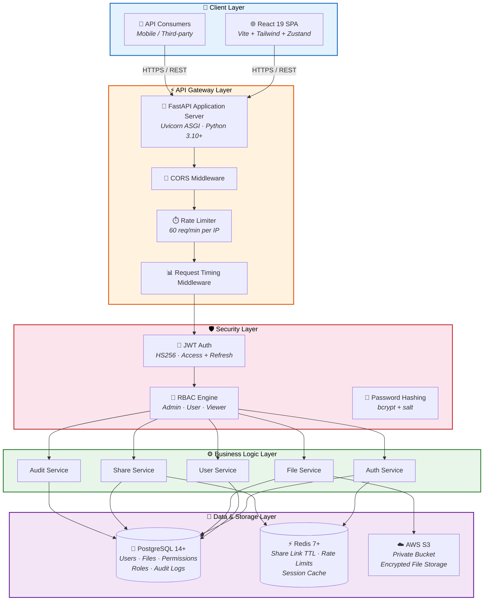
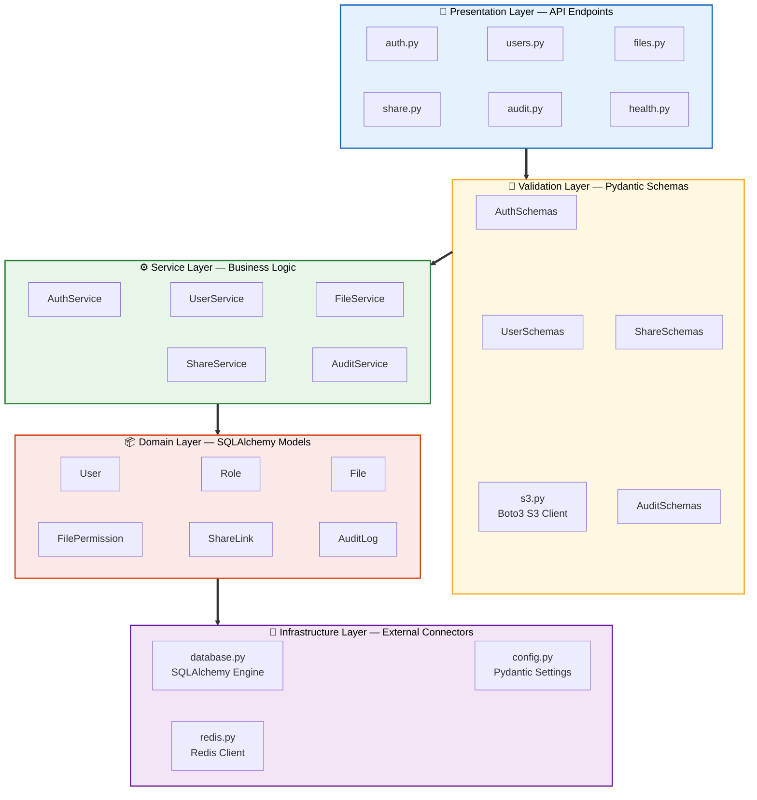
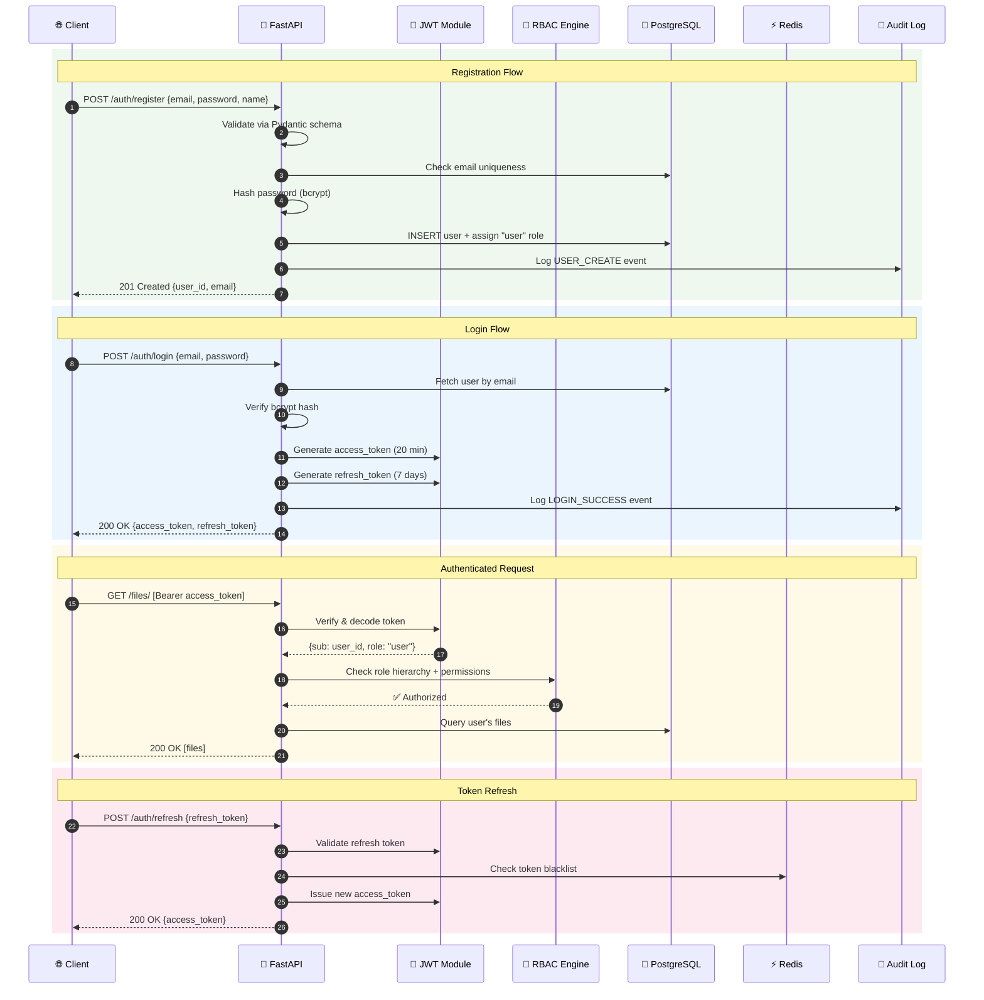
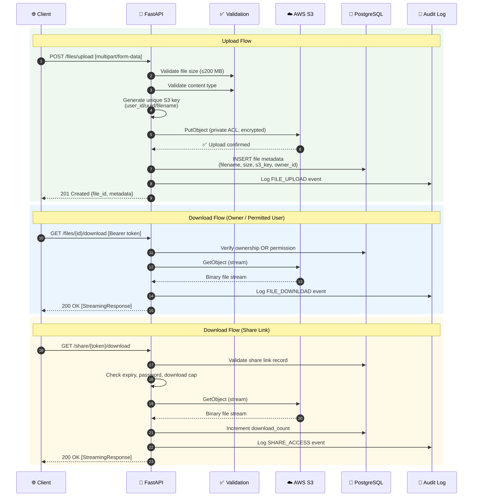
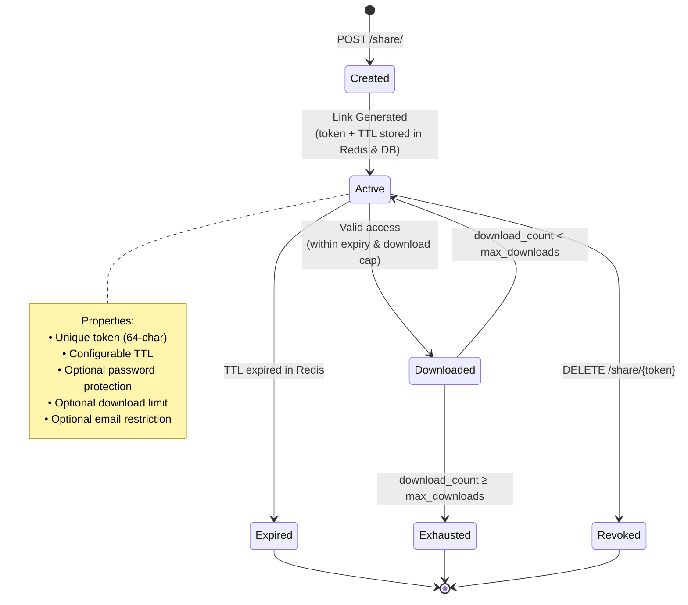
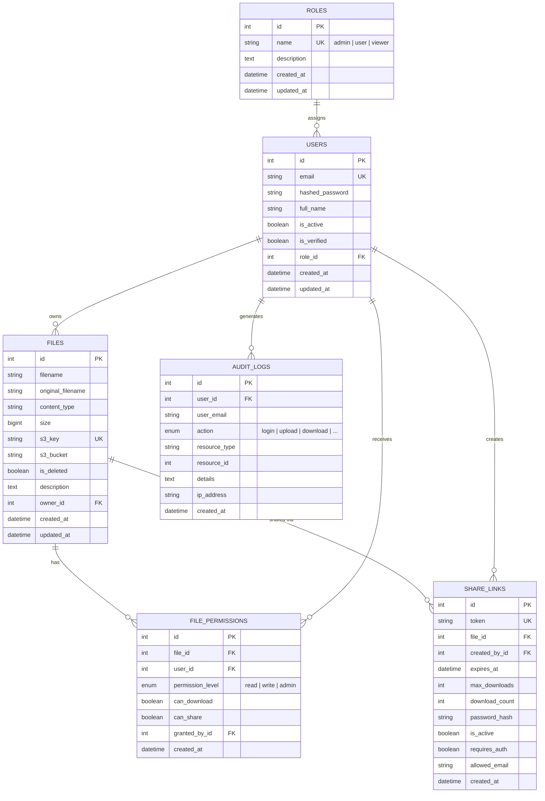
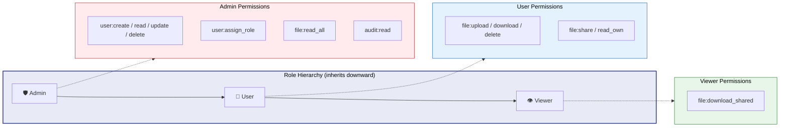

<div align="center">

# 🔒 Secure File Sharing System

**A production-ready, enterprise-grade secure file sharing platform**

[](https://python.org)
[](https://fastapi.tiangolo.com)
[](https://react.dev)
[](https://postgresql.org)
[](https://redis.io)
[](https://aws.amazon.com/s3/)
[](LICENSE)

*Built with JWT authentication, role-based access control, private S3 storage, expiring share links, and full audit logging.*

</div>

---

## 📑 Table of Contents

- [Features](#-features)
- [System Architecture](#-system-architecture)
  - [High-Level Overview](#high-level-system-overview)
  - [Backend Layered Architecture](#backend-layered-architecture)
  - [Authentication & Authorization Flow](#authentication--authorization-flow)
  - [File Upload & Download Pipeline](#file-upload--download-pipeline)
  - [Share Link Lifecycle](#share-link-lifecycle)
  - [Database Schema (ER Diagram)](#database-schema-er-diagram)
  - [Security Architecture](#security-architecture)
- [Tech Stack](#-tech-stack)
- [Prerequisites](#-prerequisites)
- [Quick Start](#-quick-start)
- [API Reference](#-api-reference)
- [User Roles & Permissions](#-user-roles--permissions)
- [Security Features](#-security-features)
- [Testing](#-testing)
- [Project Structure](#-project-structure)
- [Database Migrations](#-database-migrations)
- [Deployment](#-deployment)
- [Roadmap](#-roadmap)
- [License](#-license)

---

## ✨ Features

| Category | Feature | Description |
|----------|---------|-------------|
| **Authentication** | JWT Tokens | Access & refresh token pair with configurable expiry |
| **Authorization** | RBAC | Hierarchical roles — Admin, User, Viewer |
| **Storage** | AWS S3 Private Buckets | Zero public access; all downloads proxied through backend |
| **Sharing** | Expiring Share Links | Time-limited, password-protected, download-capped links via Redis TTL |
| **Audit** | Complete Audit Trail | Every sensitive action logged with user, IP, timestamp, and details |
| **Rate Limiting** | Redis-based Throttling | 60 req/min per IP to mitigate abuse |
| **Frontend** | React 19 SPA | Modern dashboard with Tailwind CSS, React Query, and Zustand |
| **Validation** | Pydantic v2 Schemas | Strict input/output validation on every endpoint |

---

## 🏗️ System Architecture

### High-Level System Overview



### Backend Layered Architecture



### Authentication & Authorization Flow



### File Upload & Download Pipeline



### Share Link Lifecycle



### Database Schema (ER Diagram)



### Security Architecture

```mermaid
graph TB
    subgraph PERIMETER["🌐 Perimeter Defense"]
        direction LR
        CORS_P["CORS Policy<br/><i>Origin whitelist</i>"]
        RATE_P["Rate Limiter<br/><i>60 req/min per IP</i>"]
        VALID["Input Validation<br/><i>Pydantic v2</i>"]
    end

    subgraph AUTH_LAYER["🔐 Authentication Layer"]
        direction LR
        JWT_P["JWT Verification<br/><i>HS256 · Expiry check</i>"]
        REFRESH["Refresh Token<br/><i>7-day rotation</i>"]
        BLACKLIST["Token Blacklist<br/><i>Redis-backed</i>"]
    end

    subgraph AUTHZ_LAYER["👥 Authorization Layer"]
        direction LR
        RBAC_P["RBAC Engine<br/><i>Hierarchical roles</i>"]
        PERM["Permission Check<br/><i>File-level ACLs</i>"]
        OWNER["Ownership Verification<br/><i>Resource isolation</i>"]
    end

    subgraph DATA_PROT["💾 Data Protection"]
        direction LR
        BCRYPT_P["Password Hashing<br/><i>bcrypt + auto-salt</i>"]
        S3_PRIV["S3 Private ACL<br/><i>No public access</i>"]
        PROXY["Backend Proxy<br/><i>No direct S3 URLs</i>"]
    end

    subgraph OBSERV["📊 Observability"]
        direction LR
        AUDIT_P["Audit Logging<br/><i>All actions tracked</i>"]
        TIMING_P["Response Timing<br/><i>X-Process-Time header</i>"]
        ERROR["Error Handling<br/><i>Sanitized responses</i>"]
    end

    PERIMETER --> AUTH_LAYER --> AUTHZ_LAYER --> DATA_PROT --> OBSERV

    style PERIMETER fill:#FFEBEE,stroke:#C62828,stroke-width:2px,color:#000
    style AUTH_LAYER fill:#FFF3E0,stroke:#E65100,stroke-width:2px,color:#000
    style AUTHZ_LAYER fill:#FFF8E1,stroke:#F9A825,stroke-width:2px,color:#000
    style DATA_PROT fill:#E8F5E9,stroke:#2E7D32,stroke-width:2px,color:#000
    style OBSERV fill:#E3F2FD,stroke:#1565C0,stroke-width:2px,color:#000
```



---

## 🛠️ Tech Stack

### Backend

| Technology | Purpose | Version |
|------------|---------|---------|
| **FastAPI** | ASGI Web Framework | 0.109+ |
| **Uvicorn** | ASGI Server | 0.27+ |
| **SQLAlchemy** | ORM & Database Toolkit | 2.0+ |
| **Alembic** | Database Migrations | 1.13+ |
| **Pydantic** | Data Validation & Settings | 2.6+ |
| **python-jose** | JWT Token Handling | 3.3+ |
| **bcrypt** | Password Hashing | 4.1+ |
| **Boto3** | AWS S3 SDK | 1.34+ |
| **Redis-py** | Redis Client | 5.0+ |
| **Loguru** | Structured Logging | 0.7+ |

### Frontend

| Technology | Purpose | Version |
|------------|---------|---------|
| **React** | UI Framework | 19 |
| **TypeScript** | Type Safety | 5.9+ |
| **Vite** | Build Tool & Dev Server | 7.2+ |
| **Tailwind CSS** | Utility-first CSS | 4.1+ |
| **React Query** | Server State Management | 5.90+ |
| **Zustand** | Client State Management | 5.0+ |
| **Axios** | HTTP Client | 1.13+ |
| **React Router** | Client-side Routing | 7.13+ |
| **Lucide React** | Icon Library | 0.563+ |

### Infrastructure

| Technology | Purpose | Version |
|------------|---------|---------|
| **PostgreSQL** | Primary Data Store | 14+ |
| **Redis** | Cache, Rate Limits, TTL Links | 7+ |
| **AWS S3** | File Object Storage | — |
| **Docker Compose** | Container Orchestration | 3.8 |

---

## 📋 Prerequisites

- **Python** 3.10+
- **Node.js** 18+ & npm (for frontend)
- **PostgreSQL** 14+
- **Redis** 7+
- **AWS Account** with S3 access
- **Docker** (recommended for Redis)

---

## 🚀 Quick Start

### 1. Clone and Setup Backend

```bash
cd Secure_FileSharing_System

# Create virtual environment
python -m venv venv

# Activate virtual environment
# Windows:
.\venv\Scripts\activate
# Linux/Mac:
source venv/bin/activate

# Install dependencies
pip install -r requirements.txt
```

### 2. Setup Frontend

```bash
cd frontend
npm install
cd ..
```

### 3. Start Redis (Docker)

```bash
docker-compose up -d redis
```

### 4. Create PostgreSQL Database

```sql
-- Connect to PostgreSQL and run:
CREATE DATABASE "SECUREFILE_SHARING_APPLICATION";
```

### 5. Configure Environment

Create/update the `.env` file in the project root:

```env
# PostgreSQL
POSTGRES_HOST=localhost
POSTGRES_PORT=5432
POSTGRES_USER=postgres
POSTGRES_PASSWORD=your_password
POSTGRES_DB=SECUREFILE_SHARING_APPLICATION

# Redis
REDIS_HOST=localhost
REDIS_PORT=6379

# AWS S3
AWS_ACCESS_KEY_ID=your_access_key
AWS_SECRET_ACCESS_KEY=your_secret_key
AWS_REGION=ap-south-2
S3_BUCKET_NAME=your-bucket-name

# JWT
JWT_SECRET_KEY=your_secret_key
ACCESS_TOKEN_EXPIRE_MINUTES=20
REFRESH_TOKEN_EXPIRE_DAYS=7
```

### 6. Run the Application

```bash
# Backend (from project root)
uvicorn app.main:app --reload --host 0.0.0.0 --port 8000

# Frontend (in a separate terminal)
cd frontend && npm run dev
```

### 7. Access the Application

| Interface | URL |
|-----------|-----|
| **Frontend** | http://localhost:5173 |
| **Swagger Docs** | http://localhost:8000/api/v1/docs |
| **ReDoc** | http://localhost:8000/api/v1/redoc |

---

## 📚 API Reference

### Authentication

| Method | Endpoint | Description | Auth |
|--------|----------|-------------|------|
| `POST` | `/api/v1/auth/register` | Register new user | ❌ |
| `POST` | `/api/v1/auth/login` | Login and get tokens | ❌ |
| `POST` | `/api/v1/auth/refresh` | Refresh access token | ❌ |
| `POST` | `/api/v1/auth/logout` | Logout user | ✅ |
| `GET` | `/api/v1/auth/me` | Get current user profile | ✅ |

### User Management

| Method | Endpoint | Description | Auth | Role |
|--------|----------|-------------|------|------|
| `GET` | `/api/v1/users/` | List all users | ✅ | Admin |
| `GET` | `/api/v1/users/{id}` | Get user details | ✅ | Admin |
| `PUT` | `/api/v1/users/me` | Update own profile | ✅ | Any |
| `PUT` | `/api/v1/users/{id}/role` | Assign role | ✅ | Admin |
| `DELETE` | `/api/v1/users/{id}` | Deactivate user | ✅ | Admin |

### File Operations

| Method | Endpoint | Description | Auth | Role |
|--------|----------|-------------|------|------|
| `POST` | `/api/v1/files/upload` | Upload file (≤200 MB) | ✅ | User+ |
| `GET` | `/api/v1/files/` | List own files | ✅ | User+ |
| `GET` | `/api/v1/files/shared` | List files shared with me | ✅ | Any |
| `GET` | `/api/v1/files/{id}` | Get file metadata | ✅ | Owner/Permitted |
| `GET` | `/api/v1/files/{id}/download` | Download file | ✅ | Owner/Permitted |
| `DELETE` | `/api/v1/files/{id}` | Soft-delete file | ✅ | Owner/Admin |
| `POST` | `/api/v1/files/{id}/permissions` | Grant file permission | ✅ | Owner |

### Share Links

| Method | Endpoint | Description | Auth |
|--------|----------|-------------|------|
| `POST` | `/api/v1/share/` | Create share link | ✅ |
| `GET` | `/api/v1/share/` | List own share links | ✅ |
| `GET` | `/api/v1/share/{token}/info` | Get share link info | ❌ |
| `GET` | `/api/v1/share/{token}/download` | Download via share link | ❌ |
| `DELETE` | `/api/v1/share/{token}` | Revoke share link | ✅ |

### Audit Logs

| Method | Endpoint | Description | Auth | Role |
|--------|----------|-------------|------|------|
| `GET` | `/api/v1/audit/` | Get all audit logs | ✅ | Admin |
| `GET` | `/api/v1/audit/my-activity` | Get own activity log | ✅ | Any |
| `GET` | `/api/v1/audit/file/{id}` | Get file audit history | ✅ | Owner/Admin |

### Health Check

| Method | Endpoint | Description | Auth |
|--------|----------|-------------|------|
| `GET` | `/api/v1/health` | System health status | ❌ |

---

## 👥 User Roles & Permissions



| Role | File Upload | File Download | File Share | User Mgmt | Audit Logs | View All Files |
|------|:-----------:|:-------------:|:----------:|:---------:|:----------:|:--------------:|
| **Admin** | ✅ | ✅ | ✅ | ✅ | ✅ | ✅ |
| **User** | ✅ | ✅ (own/shared) | ✅ | ❌ | Own only | ❌ |
| **Viewer** | ❌ | ✅ (shared only) | ❌ | ❌ | Own only | ❌ |

---

## 🔐 Security Features

| # | Feature | Implementation |
|---|---------|---------------|
| 1 | **Private S3 Buckets** | Zero public access; all objects stored with private ACL |
| 2 | **Backend-Proxied Downloads** | No pre-signed URLs exposed; files streamed through API |
| 3 | **JWT Token Security** | Short-lived access tokens (20 min), longer refresh tokens (7 days) |
| 4 | **Password Hashing** | bcrypt with auto-generated salt |
| 5 | **Rate Limiting** | Redis-backed, 60 requests/minute per IP |
| 6 | **Complete Audit Trail** | Every auth, file, share, and admin action logged |
| 7 | **Role-Based Access Control** | Hierarchical roles with granular permissions |
| 8 | **Input Validation** | Pydantic v2 schemas enforced on all endpoints |
| 9 | **CORS Protection** | Configurable origin whitelist |
| 10 | **Error Sanitization** | Debug details hidden in production responses |

---

## 🧪 Testing

```bash
# Run all tests
pytest

# Run with coverage report
pytest --cov=app tests/

# Run a specific test module
pytest tests/test_auth.py -v

# Run with detailed output
pytest -v --tb=short
```

---

## 📁 Project Structure

```
Secure_FileSharing_System/
│
├── app/                            # Backend application
│   ├── main.py                     # FastAPI app entry point & lifespan
│   ├── api/
│   │   └── v1/
│   │       ├── router.py           # API router aggregator
│   │       └── endpoints/          # Route handlers
│   │           ├── auth.py         #   Authentication endpoints
│   │           ├── users.py        #   User management endpoints
│   │           ├── files.py        #   File CRUD endpoints
│   │           ├── share.py        #   Share link endpoints
│   │           ├── audit.py        #   Audit log endpoints
│   │           └── health.py       #   Health check endpoint
│   ├── core/                       # Infrastructure connectors
│   │   ├── config.py               #   Pydantic settings (env vars)
│   │   ├── database.py             #   SQLAlchemy engine & session
│   │   ├── redis.py                #   Redis client wrapper
│   │   └── s3.py                   #   Boto3 S3 service
│   ├── models/                     # SQLAlchemy ORM models
│   │   ├── user.py                 #   User model
│   │   ├── role.py                 #   Role model
│   │   ├── file.py                 #   File metadata model
│   │   ├── file_permission.py      #   File-level ACL model
│   │   ├── share_link.py           #   Share link model
│   │   └── audit_log.py            #   Audit log model
│   ├── schemas/                    # Pydantic request/response schemas
│   │   ├── auth.py, user.py, file.py, share.py, audit.py
│   │   └── common.py              #   Shared schemas
│   ├── security/                   # Auth & authorization
│   │   ├── dependencies.py         #   FastAPI dependency injectors
│   │   ├── jwt.py                  #   Token create/verify
│   │   ├── password.py             #   bcrypt hash/verify
│   │   └── rbac.py                 #   Role hierarchy & permissions
│   ├── services/                   # Business logic layer
│   │   ├── auth_service.py         #   Auth workflows
│   │   ├── user_service.py         #   User CRUD logic
│   │   ├── file_service.py         #   File + S3 operations
│   │   ├── share_service.py        #   Share link management
│   │   └── audit_service.py        #   Audit log queries
│   └── utils/                      # Shared utilities
│       ├── helpers.py              #   General helpers
│       └── logging.py              #   Loguru configuration
│
├── frontend/                       # React 19 SPA
│   ├── src/
│   │   ├── api/                    #   Axios API client layer
│   │   ├── components/             #   Reusable UI components
│   │   ├── pages/                  #   Route page components
│   │   ├── store/                  #   Zustand state management
│   │   └── types/                  #   TypeScript type definitions
│   ├── package.json
│   └── vite.config.ts
│
├── migrations/                     # Alembic database migrations
│   ├── versions/
│   └── env.py
│
├── tests/                          # pytest test suite
│   ├── conftest.py                 #   Shared fixtures
│   ├── test_auth.py
│   ├── test_users.py
│   ├── test_files.py
│   ├── test_share.py
│   └── test_audit.py
│
├── alembic.ini                     # Alembic configuration
├── docker-compose.yml              # Docker services (Redis)
├── requirements.txt                # Python dependencies
└── README.md
```

---

## 🔧 Database Migrations

```bash
# Generate a new migration from model changes
alembic revision --autogenerate -m "description of change"

# Apply all pending migrations
alembic upgrade head

# Rollback the last migration
alembic downgrade -1

# View migration history
alembic history
```

---

## 🐳 Deployment

### Docker Compose (Development)

```bash
# Start Redis
docker-compose up -d redis

# View service logs
docker-compose logs -f
```

### Default Admin Account

On first startup, the system auto-creates an admin user:

| Field | Value |
|-------|-------|
| **Email** | `admin@securefile.com` |
| **Password** | *(set in .env — `ADMIN_PASSWORD`)* |

> ⚠️ **Change the default admin password immediately in production.**

---

## 🚧 Roadmap

- [ ] Dockerfile for full-stack containerization
- [ ] Kubernetes deployment manifests
- [ ] CI/CD pipeline (GitHub Actions)
- [ ] Email verification flow
- [ ] Password reset via email
- [ ] File versioning support
- [ ] Batch file operations
- [ ] WebSocket real-time notifications

---

## 📝 License

This project is licensed under the **MIT License**.

---

<div align="center">

**Secure File Sharing System** — Built for enterprise-grade secure file sharing.

</div>
